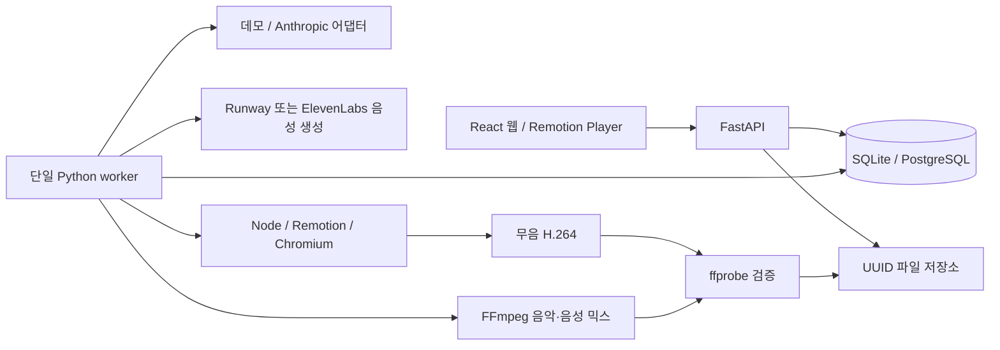
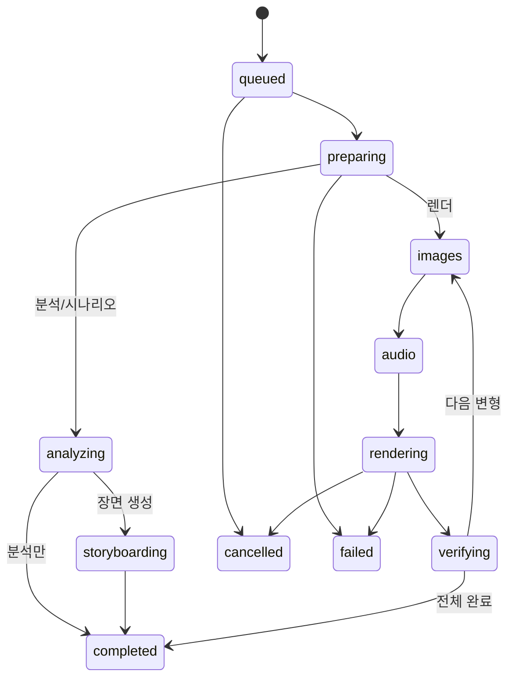

# 구조와 데이터 흐름

## 경계

API의 생성 요청은 작업 레코드를 저장한 뒤 202를 반환합니다. 네트워크 AI와 영상 렌더링은 worker에서 실행합니다. 업로드 이미지 검사는 FastAPI의 동기 라우트 스레드에서 처리합니다. 업로드 개수 12, 파일 크기 20MiB, 픽셀 수 4천만으로 제한합니다.

## 영속 모델

Project는 입력과 상태를, Asset은 원본 이름·안전 경로·MIME·해상도·해시·정렬·대표 여부를 보관합니다. Analysis는 검증된 결과와 입력 해시·모델을 저장합니다. Storyboard는 현재/초기 JSON 및 revision을 저장하고 Scene 테이블을 같은 트랜잭션에서 동기화합니다. ConceptPreset은 기본/사용자 구분을 보관합니다. RenderJob은 시도·상태·진행률·에러·취소 요청·렌더 스냅샷을, RenderOutput은 파일 맵·검증 결과를 보관합니다. AppSetting은 브랜드와 보관 정책을 저장합니다.

모든 JSON 계약은 `version: 1`입니다. Python과 TypeScript 계약은 같은 JSON fixture를 검증합니다. 타임라인은 30fps의 정수 프레임이며 총합은 반드시 선택한 전체 길이와 같습니다. 이미 올바른 프레임 길이는 저장 과정에서 변경하지 않습니다.

## 상태와 경쟁 조건

각 활성 단계는 실패·취소로 끝날 수 있습니다. 재시도는 기존 기록을 덮어쓰지 않고 새 job을 만듭니다. attempt는 증가합니다. 재시도는 현재 저장된 스토리보드로 새로운 스냅샷을 만듭니다. 활성 job에 대한 부분 고유 인덱스로 동시 요청도 한 프로젝트당 하나만 허용합니다.

worker 파일 잠금은 두 번째 프로세스를 거부합니다. 큐 항목은 조건부 UPDATE로 claim합니다. SQLite WAL 및 30초 busy timeout을 적용했습니다. 시작 시 중간 상태를 실패로 복구하고, 이미 대기 중인 작업은 계속 처리합니다. 작업 중인 프로젝트의 변경·삭제는 409입니다.

## 저장·취소·오류

- 브라우저는 700ms 후 자동 저장하며 요청을 직렬화합니다. revision이 다르면 409로 덮어쓰기를 막습니다.
- 렌더 요청 전에 최신 편집본 저장을 기다립니다. 작업은 스토리보드·프리셋·상품 스냅샷을 사용합니다.
- 렌더러는 DB나 API에 접근하지 않고 전달된 이미지 data URI와 JSON만 사용합니다.
- 취소는 DB 플래그 → worker → 렌더러 취소 파일 → Remotion cancelSignal로 전달합니다. 응답하지 않는 subprocess는 시간 제한 후 종료합니다.
- 결과는 모든 변형이 검증된 뒤 DB에 게시합니다. 실패/취소 시 해당 job의 임시·미게시 결과를 정리합니다.
- 프로젝트 삭제는 디렉터리를 임시 이름으로 이동한 뒤 DB 삭제를 commit합니다. DB 실패 시 디렉터리를 복원합니다.
- 재시작 복구는 중간 job 폴더를 정리합니다. 디스크 장애로 남은 고아 파일은 운영자가 DB와 백업을 대조해야 합니다.

## 영상과 오디오

웹 미리보기와 서버가 `Video.tsx`를 공유합니다. 애니메이션은 프레임 입력의 순수 계산입니다. 6개 레이아웃에 프리셋 팔레트·폰트·배경·전환·오버레이를 적용합니다. 일반 사진은 contain, 사용자가 명시적으로 선택한 전체 이미지 모드에서만 cover 크롭을 적용합니다. 작은 원본은 확대 상한을 두고 배경과 여백으로 보완합니다.

FFmpeg가 원본/합성 음악의 볼륨·페이드와 음성을 믹스합니다. 음성이 있으면 sidechaincompress로 덕킹합니다. 무음이어도 AAC 스트림을 생성합니다. TTS는 장면별로 생성·가속·패딩하여 자막 장면과 맞춥니다. 최종 ffprobe는 해상도, 30fps, 목표 시간 ±0.15초, H.264/AAC를 확인합니다.

`style.narrationSource`는 `caption`(현재 자막) 또는 `script`(별도 원고, 기존 프로젝트 기본값)입니다. Runway의 `text_to_speech` 비동기 작업은 영상 생성과 같은 제출·조회·취소·다운로드 처리를 사용합니다. 음성은 `projects/{pid}/speech/{내용·모델·목소리 해시}/audio.mp3`에 캐시하고 작업 ID를 별도 JSON에 저장하므로 렌더 재시도와 변형에서 재사용합니다. 직접 ElevenLabs 키·음성 ID가 모두 있으면 이를 우선 사용하고, 없으면 Runway 키를 사용합니다. 음성 연결 누락과 생성 실패는 무음 폴백 대신 오류로 처리합니다.

## 확장

- `ai.py`의 구조화 공급자 인터페이스에 다른 AI를 추가할 수 있습니다. 외부 응답은 반드시 스키마를 통과해야 합니다.
- `ProductSourceAdapter.fetch_product()`는 승인된 상품 정보를 가져오는 경계입니다. 사방넷 주소나 인증 방식을 추측하지 않습니다.
- worker의 큐 claim/process 경계를 Redis/Celery로 교체할 수 있습니다. 다중 worker 도입 시 파일 잠금·DB 락·파일 저장소도 함께 변경해야 합니다.
- PostgreSQL URL 교체 시 Alembic을 새 DB에 적용합니다. 기존 SQLite 데이터를 자동 이전하지 않습니다.
